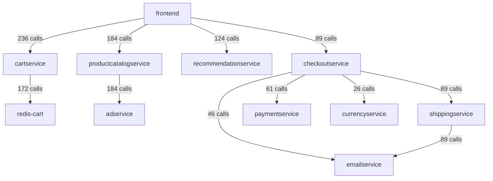
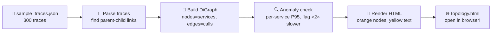
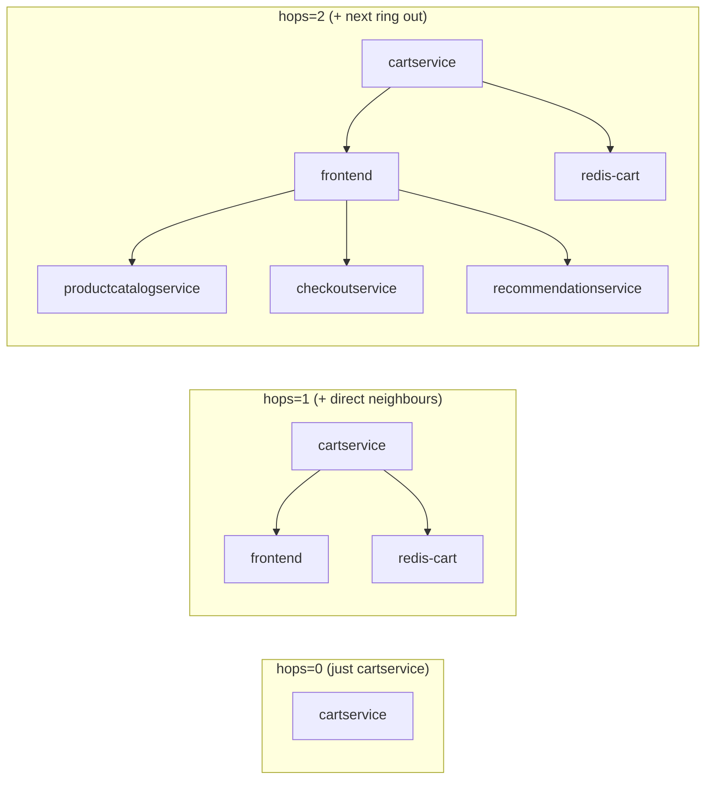
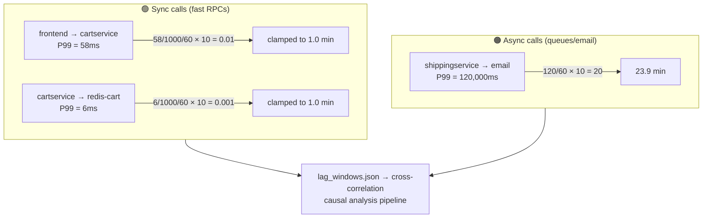
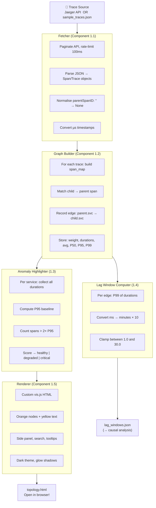
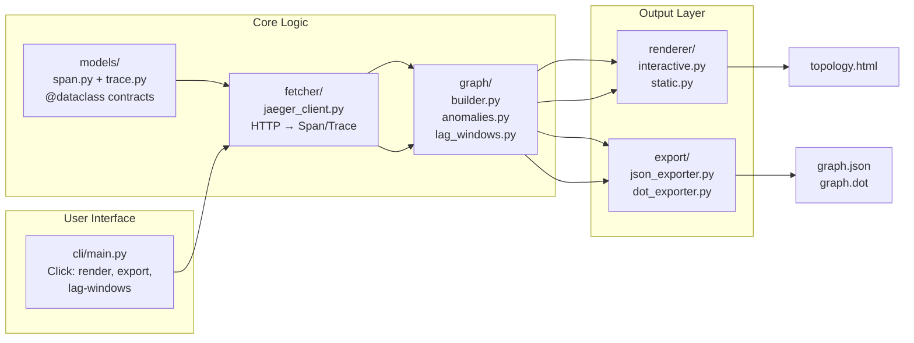
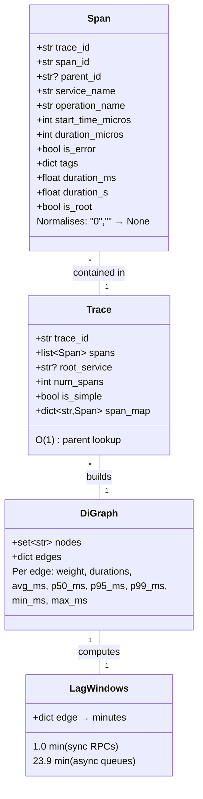
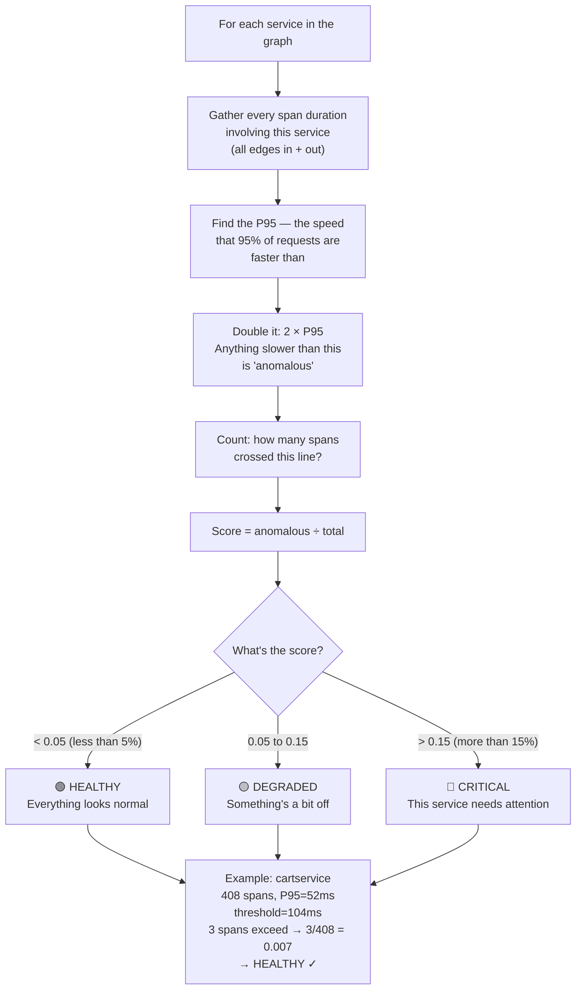
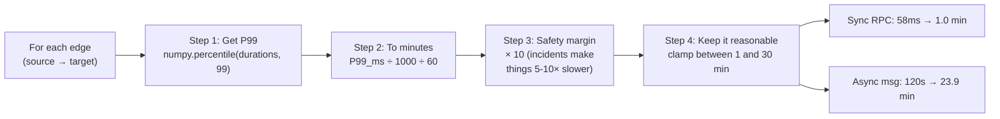

# Service Topology Manager

> **What is this?** A tool that draws a map of your microservices — showing who talks to whom, how often, and whether anything looks broken. Think of it as Google Maps for your backend architecture.

It connects to Jaeger (or a local trace file), builds a directed call graph, flags services that are slower than usual, and exports timing data for root-cause analysis.

---

## Table of Contents

- [Quick Start](#quick-start)
  - [Before anything: install](#before-anything-install)
  - [Path A: One-command demo (recommended)](#path-a-one-command-demo-recommended)
  - [Path B: Use the sample trace file](#path-b-use-the-sample-trace-file)
  - [Path C: Connect to your own Jaeger](#path-c-connect-to-your-own-jaeger)
  - [All commands at a glance](#all-commands-at-a-glance)
  - [Command deep-dives](#command-deep-dives)
- [UI Reference](#ui-reference)
- [How It Works (The Big Picture)](#how-it-works-the-big-picture)
  - [Pipeline](#pipeline)
  - [Project structure](#project-structure)
  - [Data flow between objects](#data-flow-between-objects)
  - [How anomaly detection thinks](#how-anomaly-detection-thinks)
  - [Understanding lag windows](#understanding-lag-windows)
  - [File map](#file-map)
- [Testing](#testing)
- [Ship Criteria](#ship-criteria)

---

## Quick Start

You can get up and running in **under 30 seconds**. Pick your path:

---

### Before anything: install

```bash
cd "/Users/ramster/service topology manager"
pip install -e .
```

Check it's working:

```bash
topology-map --help
# You should see: render, export, lag-windows
```

---

### Path A: One-command demo (recommended)

This spins up a graph with 11 services, anomaly detection, everything — zero setup:

```bash
bash demo.sh
```

That's it. Your browser opens with a fully interactive topology map. In ~5 seconds you get:

```
  ✓ 300 traces loaded
  ✓ 11 services discovered
  ✓ 11 call relationships mapped
  ✓ Anomaly scores computed (some cartservice spans are 5-15× slower)
  ✓ Interactive graph rendered with dark theme
```

What you're looking at:

- **Orange dots** = your services (bigger = more connections)
- **Curved orange arrows** = calls between them (thicker = busier edges)
- **Click any node** → side panel with that service's full stats
- **Click any edge** → latency distribution, lag window
- **Drag** to rearrange, **scroll** to zoom, **Ctrl+F** to search

The demo graph represents this system:



---

### Path B: Use the sample trace file

Prefer to run commands yourself? Generate the sample data, then render:

```bash
# 1. Create the sample trace file
python3 generate_sample_traces.py

# 2. Build and view the graph
topology-map render --from-file sample_traces.json --highlight-anomalies
open topology.html
```

Same output as Path A — you're just calling the steps manually. This is useful when you want to explore different commands on the same data.

---

### Path C: Connect to your own Jaeger

Already have Jaeger collecting traces? Point the tool at it:

```bash
topology-map render --jaeger-url http://localhost:16686 --lookback 1h --highlight-anomalies
```

If you have a Jaeger Docker container but **no traces**, generate some first:

```bash
# Option 1 — Use the sample file as a data source (simplest)
topology-map render --from-file sample_traces.json --highlight-anomalies

# Option 2 — Send real traces into your Jaeger, then fetch them back
# First need Jaeger with OTLP gRPC (port 4317) or Thrift UDP (port 6831) exposed
# Then use an OpenTelemetry trace generator to populate it
```

Replace the URL, lookback window, and service name with your own values. Your Jaeger needs to be reachable at the given URL and have traces within the lookback window.

---

### All commands at a glance

```bash
# ── Show the full interactive graph ──────────────────────
topology-map render --from-file sample_traces.json --highlight-anomalies

# ── Zoom into one service's neighbourhood ────────────────
topology-map render --from-file sample_traces.json --service cartservice --hops 2

# ── Save as a static image (needs: brew install graphviz) ─
topology-map render --from-file sample_traces.json --format png --output topology.png

# ── Export data for other tools ──────────────────────────
topology-map export --from-file sample_traces.json --format json     # → graph.json
topology-map export --from-file sample_traces.json --format dot      # → graph.dot

# ── Compute correlation time windows ─────────────────────
topology-map lag-windows --from-file sample_traces.json              # → lag_windows.json

# ── If you have a real Jaeger running ────────────────────
topology-map render --jaeger-url http://localhost:16686 --lookback 1h --highlight-anomalies
```

---

### Command deep-dives

#### `render` — build the graph + find slow services

```bash
topology-map render --from-file sample_traces.json --highlight-anomalies
```

What happens step by step:



**All the render options:**

| Flag | Default | What it does |
|------|---------|-------------|
| `--from-file PATH` | — | Load traces from a local JSON file (offline mode) |
| `--jaeger-url URL` | `http://localhost:16686` | Point at a real Jaeger instance |
| `--lookback DURATION` | `1h` | How far back to look (`1h`, `30m`, `15m`) |
| `--service NAME` | — | Zoom into one service's area |
| `--hops N` | `1` | How many steps out from that service |
| `--operation NAME` | — | Only show traces for a specific operation |
| `--format TYPE` | `html` | `html`, `png`, or `svg` |
| `--output PATH` | auto | Where to save the file |
| `--highlight-anomalies` | off | Turn on the anomaly detector |
| `--limit N` | `100` | Max traces per page from Jaeger |

---

#### `--service` and `--hops` — zoom into one area

When you have 100+ services, you don't want all of them on screen at once. Think of hops like *"how many friends-of-friends to include"*:



A **hop** = following one arrow in either direction. Here's how it counts:

```
   cartservice                         ← hop 0 (your starting point)
       │
       ├── frontend                    ← hop 1 (directly connected ✓)
       │       │
       │       ├── checkoutservice     ← hop 2 (friend of a friend ✓)
       │       │       │
       │       │       └── shippingservice ← hop 3 (too far away ✗)
       │       │
       │       └── productcatalogservice ← hop 2 (friend of a friend ✓)
       │               │
       │               └── adservice   ← hop 3 (too far away ✗)
       │
       └── redis-cart                 ← hop 1 (directly connected ✓)
```

Running `--service cartservice --hops 2` keeps 6 services and removes 5 — only the ones within 2 steps of cartservice survive.

---

#### `export` — save the graph as data

```bash
topology-map export --from-file sample_traces.json --format json
```

This writes `graph.json` — a machine-readable version of the graph that other tools can consume:

```json
{
  "nodes": [
    {"id": "frontend"},
    {"id": "cartservice"}
  ],
  "links": [
    {
      "source": "frontend",
      "target": "cartservice",
      "weight": 236,
      "avg_duration_ms": 45.2,
      "p50_duration_ms": 44.1,
      "p95_duration_ms": 52.3,
      "p99_duration_ms": 58.7
    }
  ]
}
```

This is the format that spectrum-based causal analysis tools consume. `--format dot` gives you a graphviz file instead.

---

#### `lag-windows` — how far back to check for cause-and-effect

```bash
topology-map lag-windows --from-file sample_traces.json
```

Writes `lag_windows.json`. Here's what you get and why:



**Why the numbers differ:**

| Edge type | Real P99 | Formula | Lag window |
|-----------|----------|---------|------------|
| Sync RPC (200ms) | 58 ms | (0.058/60)×10 = 0.01 | **1.0 min** (bumped to minimum) |
| Cache lookup | 6 ms | (0.006/60)×10 = 0.001 | **1.0 min** (bumped to minimum) |
| Async message | 120,000 ms | (120/60)×10 = 20 | **23.9 min** |
| Batch email | 200,000 ms | (200/60)×10 = 33.3 | **30.0 min** (capped at max) |

> Why ×10? Because during incidents, latencies can jump 5-10× normal. The safety multiplier makes sure the window is wide enough to still catch the correlation. We clamp it between 1 and 30 minutes so it's always reasonable.

---

## UI Reference

```
┌────────────────────────────────────────────────────────────────┐
│  TOPOLOGY MAPPER | dependency graph       NODES: 11  EDGES: 11 │
├────────────────────────────────────────────────────────────────┤
│                                                                │
│  ┌──────────────┐               ┌──────────────────────────┐   │
│  │ 🔍 Search... │               │                          │   │
│  └──────────────┘               │    Interactive graph      │   │
│                                 │    (drag · zoom · click)  │   │
│                                 │                          │   │
│                                 │                          │   │
│                                 └──────────────────────────┘   │
│                                                                │
│  CLICK a node → side panel  ·  DRAG to rearrange  ·  SCROLL   │
└────────────────────────────────────────────────────────────────┘
```

**Side panel** (slides in from the right when you click a node or edge):

```
┌─ SERVICE DETAILS ─────────────────── [✕] ─┐
│                                            │
│  STATUS                                     │
│  ┌──────────────────┐                      │
│  │     HEALTHY      │    ← colour badge    │
│  └──────────────────┘                      │
│                                            │
│  METRICS                                    │
│  Total Spans  ···············  472         │
│  Anomalous    ···············    3         │
│  Score        ···············  0.01        │
│  P95 Baseline ···············  52ms        │
│                                            │
│  CONNECTIONS                                │
│  Degree       ···············    4         │
│  In / Out     ···············  2 / 2       │
│                                            │
│  LATENCY PROFILE                            │
│  P95 Inbound  ···············  58ms        │
│  P95 Outbound ···············   6ms        │
│                                            │
│  CALLED BY                                  │
│  ← frontend                                │
│                                            │
│  CALLS TO                                   │
│  redis-cart →                              │
└────────────────────────────────────────────┘
```

**Keyboard shortcuts:**

| Key | Does |
|-----|------|
| `Ctrl+F` | Jump to the search box |
| `Esc` | Close side panel, clear everything |
| `Ctrl+0` | Fit the whole graph on screen |
| Double-click a node | Zoom right into it |

---

## How It Works (The Big Picture)

### Pipeline

Here's how data flows from a trace source all the way to the browser:



### Project structure



### Data flow between objects



### How anomaly detection thinks



### Understanding lag windows



**Why this matters for causal analysis:** When an upstream service fails, the downstream symptom might appear minutes later. The lag window tells the causal analysis engine exactly how many minutes back to search when cross-correlating upstream and downstream anomalies to find the root cause.

### File map

```
service-topology-manager/
│
├── src/
│   ├── models/
│   │   ├── span.py              ← A single span (one step in a request chain)
│   │   └── trace.py             ← A full trace (all the steps in one request)
│   │
│   ├── fetcher/
│   │   └── jaeger_client.py     ← Talks to Jaeger, fetches and parses traces
│   │
│   ├── graph/
│   │   ├── builder.py           ← Turns traces into a NetworkX directed graph
│   │   ├── anomalies.py         ← Finds services that are slower than usual
│   │   └── lag_windows.py       ← Computes per-edge timing windows
│   │
│   ├── renderer/
│   │   ├── interactive.py       ← Builds the full HTML/JS interactive graph
│   │   └── static.py            ← Builds PNG/SVG images via graphviz
│   │
│   ├── export/
│   │   ├── json_exporter.py     ← Writes graph as node-link JSON
│   │   └── dot_exporter.py      ← Writes graph as DOT (graphviz format)
│   │
│   ├── cli/
│   │   └── main.py              ← The command-line interface (Click)
│   │
│   └── utils/
│       └── timing.py            ← Timestamp helpers, lookback parser
│
├── tests/                       ← 45 tests across 7 files
├── generate_sample_traces.py    ← Creates fake trace data for testing
├── sample_traces.json           ← The generated fake trace file
├── pyproject.toml               ← Package config + entry point
├── requirements.txt             ← Python dependencies
└── README.md                    ← You are here
```

---

## Testing

```bash
# Run everything
pytest tests/ -v

# Run one file
pytest tests/test_graph_builder.py -v

# See full error details when something fails
pytest tests/ -v --tb=long
```

| Test file | What it checks |
|-----------|---------------|
| `test_models.py` | Span/Trace creation, parent normalisation, µs→ms conversion |
| `test_jaeger_client.py` | Trace JSON parsing, pagination, service name extraction |
| `test_graph_builder.py` | DiGraph building, parent-child matching, edge stats, subgraph filtering |
| `test_anomalies.py` | P95 baseline, 2× threshold, healthy/degraded/critical classification |
| `test_lag_windows.py` | P99→lag conversion, clamping, sync vs async edges, JSON export |
| `test_export.py` | JSON node-link format, DOT output, durations stripping |
| `test_renderer.py` | HTML generation, anomaly-aware rendering (graphviz tests skip if no `dot`) |

---

## Ship Criteria

- [x] Fetches traces from Jaeger API with pagination and rate limiting
- [x] Loads traces from local JSON file (offline mode — no Jaeger needed)
- [x] Builds accurate directed graph with per-edge call counts and raw durations
- [x] Computes avg, P50, P95, P99 for every edge
- [x] Anomaly detection: per-service P95 baseline, 2× threshold, three status levels
- [x] Interactive HTML: dark theme, click-to-inspect side panel, search, keyboard shortcuts
- [x] Per-edge lag windows: P99 × 10 safety factor, clamped [1, 30] minutes
- [x] CLI with `render`, `export`, `lag-windows` — all self-documenting via `--help`
- [x] JSON export (node-link) for downstream spectrum analysis · DOT export for graphviz
- [x] Neighborhood filter: `--service` + `--hops` to zoom into one area
- [x] Handles edge cases: missing parents, empty responses, single-span traces
- [x] Works with any Jaeger instance (not hardcoded to one demo)
- [x] 42 passing tests across all components
